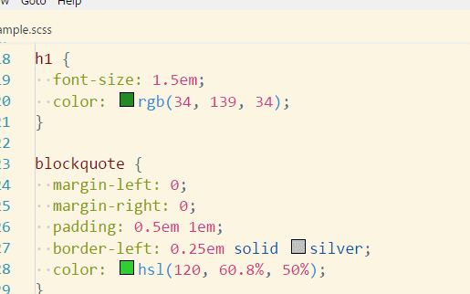
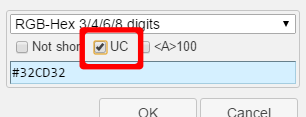
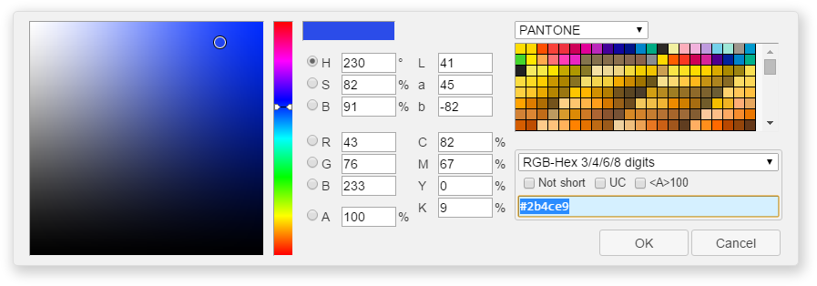
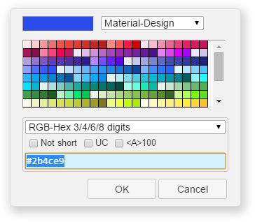

# Color Picker for VS Code

Helper with GUI to generate color codes such as CSS color notations.  
And, a command [`Convert Color`](#convert-color) to change the color notation.

A dialog box is shown by pressing `Alt + C P` keys or command `Pick Color`. If a cursor is positioned on a string that is color notation at that time, that string is selected as target for editing.


* Supported color spaces to edit the color: HSB (HSV), RGB, Lab, and CMYK. With alpha channel.
* Supported color notations to output the color: `hsb()`/`hsba()`, `hsl()`/`hsla()`, `hwb()`, `rgb()`/`rgba()`, RGB-Hex 3/4/6/8 digits, CSS Named Color, `device-cmyk()` and `gray()`.
* Custom color palettes supported.
* Multiple cursors supported.


## Install

You need [Node.js](https://nodejs.org/) installed and available in your `$PATH`.  
Then, launch the Command Pallete (`Ctrl + Shift + P` or `Cmd + Shift + P`) and type `ext install`, and then look for "Color Picker".

## Usage

A dialog box is shown by pressing `Alt + C P` keys or command `Pick Color`.  
If a cursor is positioned on a string that is color notation at that time, that string is selected as target for editing. The color notation is recognized even if it includes line-breaks and comments.  
For example:

```css
background-color: hsl(
  136,
  77%, /* When it is blurred, change to 32% */
  84%
  );
```

Multiple cursors also supported.

You can see tooltip information for some controls in the dialog box by hovering a mouse on those.

### Convert Color

When a cursor or multiple cursors are positioned on strings that are color notation, press `Alt + C C` keys or run a command `Convert Color`.  
Then a list of color notations is shown. The each target string is converted to a same color with the notation you chose.



It is converted with the notation you chose and current state of `Pick Color` dialog box.  
For example, you turned on an `UC` (upper-case) option of `RGB-Hex` in the dialog box, and you invoked the command `Convert Color` with `white` as a target and a notation `RGB-Hex`, then that `white` is converted to `#FFF`. If you turned off that option, it is converted to `#fff`.



## Options

You can specify following options by User Settings or Workspace Settings.

### `colorHelper.pickerForm`

A name of preset package that switches UI and features.  
Allowed values are:

* `default`


* `largePalette`



* `simple`


* `compact`


* `compact2`


* `byPalette`



### `colorHelper.storeDir`

A path to directory that contains your color palettes.  
For information about color palettes, see `README.md` that is found in that directory.

### `colorHelper.resident`

Stands by for a quick response.  
After the dialog box is opened, it stays in memory even after it is closed until VS Code is exited (or VS Code might unload it).
